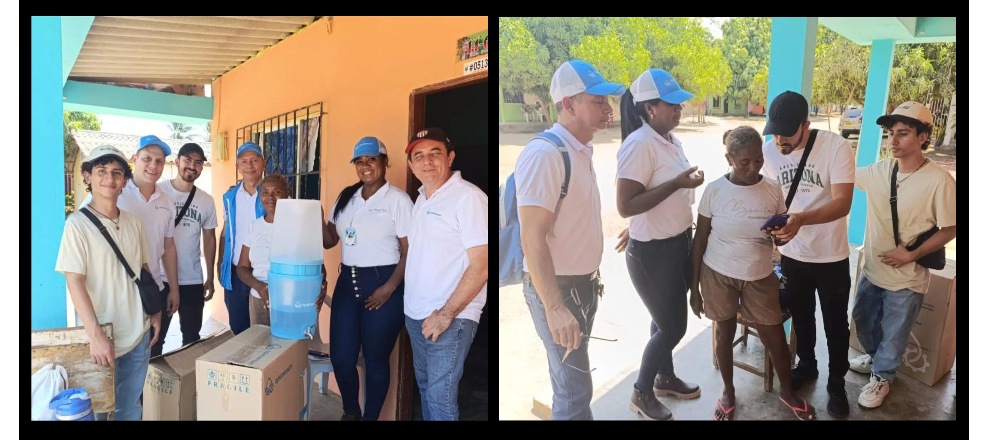
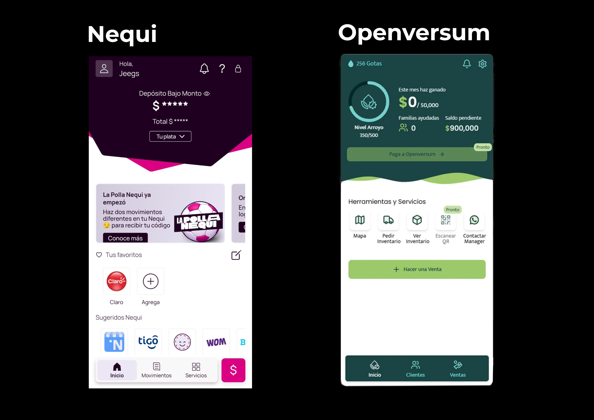
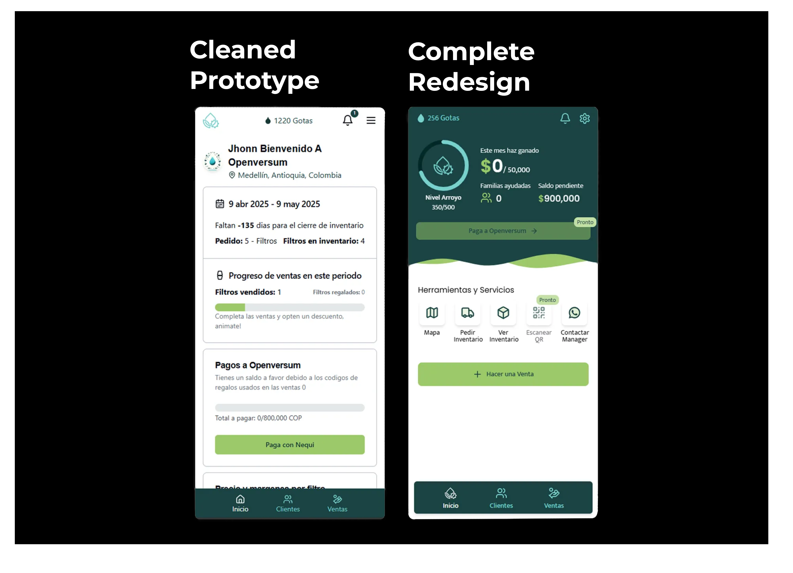

# Caso de Estudio: Openversum

Me uní a Openversum _(una empresa de impacto social suiza que lleva agua limpia a zonas rurales de latinoamérica)_ como **desarrollador fullstack** pero él también trabaja como el solo **desarrollador frontend y UX/UI**.

Heredé tres aplicaciones prototipo inestables con usuarios reales dependiendo de ellas, y dejé atrás dos aplicaciones listas para producción construidas desde cero: una aplicación de emprendedor rediseñada a punto de recibir sus primeros usuarios reales, y una plataforma de administración funcional.

En el camino resolví **tres problemas que la mayoría de los desarrolladores nunca enfrentan:** aplicaciones que deben funcionar sin internet, usuarios que no saben qué es el correo electrónico, e interfaces lo suficientemente complejas para gestionar inventario pero lo suficientemente simples para alguien que nunca ha usado un smartphone.

## La Empresa

---

[Openversum](https://www.openversum.com/es) es una empresa de impacto social suiza con operaciones en América Latina. Su misión: hacer que las tecnologías de agua limpia sean asequibles y accesibles para comunidades que no tienen acceso a ellas.

Lo logran a través de un Modelo de Agente Comunitario. Openversum equipa a miembros locales de la comunidad _(emprendedores)_ con filtros de agua para vender y una aplicación móvil para gestionar su negocio: pedidos de inventario, reporte de ventas, pagos de deuda a Openversum. La aplicación no es un complemento agradable. Es la infraestructura que hace posible todo el modelo.

## La Situacion Inicial

---

Me uní en julio de 2024 como Full Stack Developer, pero rápidamente me asenté en el rol donde más se me necesitaba: desarrollo frontend y diseño UX/UI.

Lo que encontré fue una situación típica de startup en etapa temprana, pero con apuestas inusualmente altas. La empresa tenía tres aplicaciones: Entrepreneur, Admin y eLearning. Todas construidas rápidamente como prototipos sobre Supabase y SvelteKit. El problema: tenían usuarios reales dependiendo de ellas. Especialmente la app de Entrepreneur, donde los managers habían empezado a llenar los vacíos manualmente. Actuando como tutores, soporte técnico y parches, porque la aplicación no podía manejar todo lo que necesitaba.

Simplemente apagar los prototipos no era una opción. El sustento de personas estaba atado a estas herramientas.

Mi compañero y yo evaluamos la situación y propusimos una estrategia de dos vías: mantener y estabilizar las aplicaciones existentes para que dejaran de causar daño activo, mientras construíamos las nuevas versiones en paralelo sobre una arquitectura adecuada. Iríamos desplazando la prioridad gradualmente del mantenimiento al nuevo desarrollo a medida que controláramos los incendios.

Por defecto de nuestras fortalezas, yo lideré el frontend y el diseño. Mi compañero lideró el backend y DevOps.

Para las nuevas apps, propuse Astro para la app de Entrepreneur (liviana, crítico para entornos con baja conectividad) y Next.js para Admin (ecosistema estándar de la industria, mejor adaptado para interactividad compleja). La app de eLearning no fue priorizada para una reconstrucción completa.

## Los Retos:

### 1. La aplicación debe funcionar sin internet

---

**El problema** Los emprendedores de Openversum viven en zonas rurales de Colombia. El internet confiable no es algo garantizado, muchas veces simplemente no existe. Pero todo el modelo de negocio depende de que la aplicación sea usable. Si la app no carga, el emprendedor no puede hacer pedidos, reportar ventas ni rastrear inventario. El negocio se detiene.

Esto no era un caso extremo hipotético. Era la realidad cotidiana de las personas para quienes estábamos construyendo.

**La solución** Dividí esto en dos partes.

- **Primero:** convertir la app en una PWA (Progressive Web App). Esto significa que los emprendedores pueden instalarla directamente desde su navegador (sin tienda de apps, sin cuenta necesaria) y acceder a datos en caché incluso sin conexión.

- **Segundo:** diseñar un sistema de sincronización de datos. Esta fue la parte más difícil. Cuando un emprendedor hace cambios sin conexión, esos cambios necesitan eventualmente llegar a la base de datos en la nube sin corromper datos existentes ni generar conflictos. Diseñamos un sistema de cola de requests: cuando regresa la conectividad, la app envía las solicitudes pendientes una por una. Si una falla, la cola se pausa y espera input del usuario antes de reintentar, sin pérdida silenciosa de datos, sin errores en cascada. Los conflictos y errores que no pudieran resolverse automáticamente quedarían marcados para que el manager asignado los gestionara.

El sistema de sincronización completo es significativamente más complejo que este resumen. **Lo documentamos en un diagrama de flujo detallado **, pero el principio de diseño central era conservador: preferir lento y seguro sobre rápido y riesgoso.

### 2. Los usuarios no están familiarizados con la tecnología

---

**El problema** Los emprendedores que usan esta app son frecuentemente personas con poca exposición a smartphones o interfaces digitales. No es una crítica, es una restricción de diseño que cambia completamente cómo se piensa el UX.

El prototipo que heredamos tenía formularios web básicos: labels, inputs, botones de envío. Lo estándar. El problema es que "lo estándar" asumía una línea base de alfabetización digital que muchos de nuestros usuarios no tenían. Durante una visita de campo a Cartagena en marzo de 2025, donde el equipo visitó a emprendedores reales usando la app, vi esto de primera mano. Una emprendedora, Doña Marta, no recordaba su correo ni su contraseña. El proceso de inicio de sesión solo se volvió una frustración de varios minutos. Cuando llegó el momento de hacer un pedido de inventario, el formulario la paralizó. No sabía por dónde empezar.

Ese viaje recalibró todo.

**La solución** Abordé el rediseño con un punto de referencia: Nequi. Es una de las apps financieras más usadas en Colombia, lo que significa que muchos de nuestros usuarios ya estaban familiarizados con sus patrones _(navegación inferior, header grande con información clave, accesos rápidos a los flujos más comunes.)_ Tomé esa estructura deliberadamente, no estéticamente. El objetivo era reducir la distancia cognitiva entre algo que ya conocían y algo nuevo.

Para los flujos que requerían mucha información (como hacer un pedido de inventario) dividí la interfaz en pasos de una sola pantalla. En lugar de un formulario con diez campos, el usuario ve una pregunta a la vez, escrita en lenguaje conversacional simple ("¿Cuántos filtros quieres pedir?"), con un input grande y navegación de Anterior / Siguiente. Una pregunta. Una respuesta. Avanzar.

Todo lo que no era estrictamente necesario que el emprendedor gestionara directamente, lo trasladamos a responsabilidad del manager.

Y para la autenticación: reemplazamos email + contraseña con número de teléfono + OTP por WhatsApp. Sin necesidad de cuenta de correo. Sin contraseña que olvidar. El emprendedor recibe un código en WhatsApp, una app que ya usa a diario, e inicia sesión. Simple, familiar, confiable.

### 3. Los prototipos tenían usuarios reales y no podían simplemente reemplazarse

---

**El problema** Este no era un proyecto desde cero. Las aplicaciones existentes tenían usuarios reales, dependencias reales, y managers que habían construido flujos de trabajo alrededor de sus limitaciones. Una transición forzada "la app vieja ya no existe, usa la nueva" estaba descartada.

Los prototipos también estaban construidos con patrones que los hacían frágiles: difíciles de mantener, difíciles de extender, y con un frontend funcional pero no lo suficientemente intuitivo para la base de usuarios. Cada cambio arriesgaba romper algo más.

**La solución** La vía de mantenimiento fue primero. Antes de escribir una sola línea de las nuevas apps, mi compañero y yo triamos los problemas más críticos en los prototipos y los corregimos de la manera menos invasiva posible. El objetivo no era refactorizar todo, era detener el sangrado.

En el prototipo de Entrepreneur específicamente, rediseñé la interfaz lo suficiente como para eliminar los problemas de usabilidad más graves, sin hacer cambios tan grandes que introdujeran nuevos bugs o retrasaran el trabajo real. Era una calibración cuidadosa: mejorar sin desestabilizar.

A medida que los prototipos se estabilizaron, desplazamos la prioridad a las nuevas construcciones. La nueva app de Entrepreneur fue construida en Astro, elegida específicamente por su output liviano, importante cuando apuntas a usuarios con conexiones lentas o intermitentes. La nueva app de Admin fue construida en Next.js, que nos dio un ecosistema maduro y mejores herramientas para los flujos más complejos y cargados de datos que los managers necesitaban.

## Lo que aporte a Openversum

---

Cuando terminé en Openversum, esto es lo que existía:

**Nueva app de Entrepreneur** Construida desde cero en Astro. Habilitada como PWA con soporte offline y cola de sincronización de datos. UX rediseñada basada en los patrones de navegación de Nequi y flujos de formularios paso a paso. Autenticación por OTP de WhatsApp reemplazando email/contraseña. Lista para recibir sus primeros usuarios reales.

**Nueva app de Admin** Construida en Next.js. Features principales implementadas y funcionales. Backend completamente operacional (desarrollado por mi compañero). Equipada para que los managers gestionen inventario, usuarios y resolución de conflictos del sistema de sincronización.

**Prototipos mantenidos** Estabilizados y en funcionamiento durante toda la transición, para que ningún usuario real fuera interrumpido mientras se construían las nuevas versiones.

**Arquitectura de sincronización** Diseñada y documentada: un sistema de sincronización offline-a-nube basado en colas, construido para entornos de baja conectividad, con manejo de errores y resolución de conflictos a nivel de manager.
